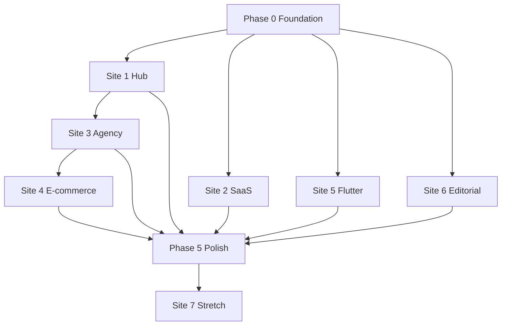

# WebsitePortfolios — Execution Task Backlog

**Version:** 1.0  
**Date:** 2026-06-10  
**Duration:** 12–16 weeks (solo developer)  
**Source of truth:** [`cto_plan.md`](./cto_plan.md)

---

## Progress Tracker

| Metric | Value |
|--------|-------|
| **Total tasks** | 118 |
| **Completed** | 116 |

| Phase | Tasks | Done | % |
|-------|-------|------|---|
| 0 — Foundation | 18 | 18 | 100% |
| 1 — Credibility (Hub + SaaS) | 40 | 40 | 100% |
| 2 — Brand (Agency) | 12 | 11 | 92% |
| 3 — Commerce | 14 | 14 | 100% |
| 4 — Breadth (Flutter + Editorial) | 25 | 25 | 100% |
| 5 — Polish | 5 | 5 | 100% |
| Stretch (Site 7) | 4 | 0 | 0% |

### How to use this file

- **Status:** Check `[ ]` → `[x]` when done.
- **Priority:** P0 = blocks other work · P1 = core MVP · P2 = polish
- **Estimate:** XS (≤2h) · S (4h) · M (8h) · L (16h) · XL (24h+)
- Start with **TASK-001**. Respect **Dependencies** before starting a task.

### Assumptions & constraints

- Solo developer who also owns UX/design (no separate design handoff).
- No real backends — mock data, JSON, or static content only.
- Flutter uses its own toolchain outside Turborepo JS pipeline.
- Site 7 is optional stretch — not on critical path.

---

## 2. Executive Summary

### Milestones

| Week | Milestone |
|------|-----------|
| 1–2 | Monorepo, shared packages, hub shell, deploy pipelines live |
| 3–5 | Portfolio Hub complete + Pulse SaaS demo deployable |
| 6–8 | Atelier North agency site + hub case studies for S1–S3 |
| 9–11 | Forma Shop e-commerce + case study on hub |
| 12–14 | Habit Flutter web + Surface editorial + case studies |
| 15–16 | Cross-linking, Lighthouse 95+, a11y audit, OG images |

### Critical path

`TASK-001` → `TASK-005` → `TASK-016` → `TASK-023` → `TASK-040` → `TASK-041` → `TASK-058` → `TASK-110`

### Key risks & mitigations

| Risk | Mitigation |
|------|------------|
| Scope creep across 6 distinct brands | Lock per-site MVP routes first; defer P2 polish |
| Flutter web build/deploy friction | Stand up Firebase/GH Pages in Phase 0 (TASK-015) |
| Motion hurting a11y/perf | `prefers-reduced-motion` on every animated site |
| Inconsistent quality bar | Phase 5 dedicated Lighthouse + a11y gate tasks |
| Case studies delayed | Write template in Phase 0; draft during each site build |

---

## 3. Global / Cross-Cutting Tasks

- [x] **TASK-001** | P0 | Phase 0 | Global | Engineering Setup
  - **Title:** Initialize pnpm monorepo root
  - **Description:** Create root `package.json`, `pnpm-workspace.yaml`, and folder structure per `cto_plan.md` monorepo layout.
  - **Acceptance criteria:**
    - [ ] `apps/` and `packages/` directories exist
    - [ ] Workspace globs include `apps/*` and `packages/*`
    - [ ] Root scripts placeholder for `dev`, `build`, `lint`
  - **Dependencies:** None
  - **Estimate:** S (4h)
  - **Owner:** Solo Dev
  - **Refs:** Monorepo Structure

- [x] **TASK-002** | P0 | Phase 0 | Global | Engineering Setup
  - **Title:** Configure Turborepo pipeline
  - **Description:** Add `turbo.json` with `build`, `dev`, `lint` tasks for JS/TS apps only.
  - **Acceptance criteria:**
    - [ ] `turbo.json` defines task dependencies (`build` depends on `^build`)
    - [ ] Flutter app excluded from Turborepo pipeline
    - [ ] `pnpm turbo build` runs without error on empty apps
  - **Dependencies:** TASK-001
  - **Estimate:** S (4h)
  - **Owner:** Solo Dev
  - **Refs:** Monorepo Structure, Tooling

- [x] **TASK-003** | P0 | Phase 0 | Global | Engineering Setup
  - **Title:** Create shared `tsconfig` package
  - **Description:** Publish base TypeScript configs for Next.js, React, and library packages.
  - **Acceptance criteria:**
    - [ ] `packages/tsconfig` with `base.json`, `nextjs.json`, `react.json`
    - [ ] Documented consumption pattern in package README
  - **Dependencies:** TASK-001
  - **Estimate:** XS (2h)
  - **Owner:** Solo Dev
  - **Refs:** Monorepo Structure

- [x] **TASK-004** | P0 | Phase 0 | Global | Engineering Setup
  - **Title:** Create shared `eslint-config` package
  - **Description:** Unified ESLint + Prettier rules for all JS/TS apps.
  - **Acceptance criteria:**
    - [ ] `packages/eslint-config` exportable config
    - [ ] Covers TypeScript, React, and Next.js rulesets
  - **Dependencies:** TASK-001
  - **Estimate:** S (4h)
  - **Owner:** Solo Dev
  - **Refs:** Monorepo Structure

- [x] **TASK-005** | P0 | Phase 0 | Global | Engineering Setup
  - **Title:** Create `ui-tokens` shared package
  - **Description:** Implement shared spacing scale (4/8px), neutral grays, and motion duration/easing tokens.
  - **Acceptance criteria:**
    - [ ] Spacing scale exported (4/8px system)
    - [ ] Neutral gray palette exported
    - [ ] Motion duration and easing tokens exported
    - [ ] README documents what is shared vs per-site (brand color, typography)
  - **Dependencies:** TASK-001
  - **Estimate:** M (8h)
  - **Owner:** Solo Dev
  - **Refs:** Shared Design System

- [x] **TASK-006** | P1 | Phase 0 | Global | Documentation
  - **Title:** Write root README with monorepo guide
  - **Description:** Document repo purpose, app list, dev commands, and link to `cto_plan.md`.
  - **Acceptance criteria:**
    - [ ] Prerequisites listed (Node, pnpm, Flutter SDK)
    - [ ] Per-app dev instructions summarized
    - [ ] Deployment overview table included
  - **Dependencies:** TASK-001, TASK-002
  - **Estimate:** S (4h)
  - **Owner:** Solo Dev
  - **Refs:** Monorepo Structure

- [x] **TASK-007** | P1 | Phase 0 | Global | Documentation
  - **Title:** Create case study MDX template
  - **Description:** Add `docs/case-studies/_template.mdx` matching the 6-point Expert UI/UX structure.
  - **Acceptance criteria:**
    - [ ] Sections: Problem, Research, IA, Design decisions, A11y & performance, Outcome
    - [ ] Frontmatter fields: title, site, stack, demoUrl, coverImage
  - **Dependencies:** TASK-001
  - **Estimate:** XS (2h)
  - **Owner:** Solo Dev
  - **Refs:** Expert UI/UX Differentiation

- [x] **TASK-008** | P0 | Phase 0 | Global | Quality & Launch
  - **Title:** Set up Vercel project for hub
  - **Description:** Connect repo to Vercel; configure root domain `yourname.dev` for hub app.
  - **Acceptance criteria:**
    - [ ] Vercel project linked to `apps/hub`
    - [ ] Preview deployments work on PR/push
    - [ ] Production domain placeholder configured
  - **Dependencies:** TASK-019
  - **Estimate:** S (4h)
  - **Owner:** Solo Dev
  - **Refs:** Deployment Matrix

- [x] **TASK-009** | P0 | Phase 0 | Global | Quality & Launch
  - **Title:** Set up Vercel projects for Next.js/Vite demos
  - **Description:** Configure subdomain deployments for SaaS, Agency, and E-commerce apps.
  - **Acceptance criteria:**
    - [ ] Subdomain pattern documented (`saas.yourname.dev`, etc.)
    - [ ] Each app has isolated Vercel project or monorepo path routing
  - **Dependencies:** TASK-002
  - **Estimate:** M (8h)
  - **Owner:** Solo Dev
  - **Refs:** Deployment Matrix

- [x] **TASK-010** | P0 | Phase 0 | Global | Quality & Launch
  - **Title:** Set up Flutter web hosting
  - **Description:** Configure Firebase Hosting or GitHub Pages for `habit.yourname.dev`.
  - **Acceptance criteria:**
    - [ ] Hosting target created and DNS pattern documented
    - [ ] Manual deploy script or CI workflow documented
    - [ ] Flutter build output path documented
  - **Dependencies:** TASK-001
  - **Estimate:** M (8h)
  - **Owner:** Solo Dev
  - **Refs:** Deployment Matrix, Site 5

- [x] **TASK-011** | P1 | Phase 0 | Global | Quality & Launch
  - **Title:** Set up editorial site hosting account
  - **Description:** Create Netlify or Vercel project placeholder for `surface.yourname.dev`; finalize build settings when app exists (TASK-109).
  - **Acceptance criteria:**
    - [ ] Hosting account/project created
    - [ ] Domain pattern documented
  - **Dependencies:** TASK-001
  - **Estimate:** S (4h)
  - **Owner:** Solo Dev
  - **Refs:** Deployment Matrix

- [x] **TASK-012** | P1 | Phase 0 | Global | Engineering Setup
  - **Title:** Add CI baseline (lint + typecheck)
  - **Description:** GitHub Actions workflow running lint and typecheck across workspace on push.
  - **Acceptance criteria:**
    - [ ] Workflow runs on push to main and PRs
    - [ ] Fails on lint or TypeScript errors in JS/TS apps
  - **Dependencies:** TASK-002, TASK-004
  - **Estimate:** S (4h)
  - **Owner:** Solo Dev
  - **Refs:** Monorepo Structure

- [x] **TASK-013** | P1 | Phase 0 | Global | Discovery & UX
  - **Title:** Document per-site brand token guidelines
  - **Description:** Create `docs/design-tokens.md` listing shared vs per-site tokens and examples per demo.
  - **Acceptance criteria:**
    - [ ] Table mirrors Shared Design System from `cto_plan.md`
    - [ ] Example typography/color choices listed for all 6 sites
  - **Dependencies:** TASK-005
  - **Estimate:** S (4h)
  - **Owner:** Solo Dev
  - **Refs:** Shared Design System

- [x] **TASK-014** | P2 | Phase 0 | Global | Documentation
  - **Title:** Define env variable conventions
  - **Description:** Document `.env.example` patterns per app (demo URLs, analytics placeholders).
  - **Acceptance criteria:**
    - [ ] `docs/env.md` lists required vars per app
    - [ ] No secrets committed; examples only
  - **Dependencies:** TASK-001
  - **Estimate:** XS (2h)
  - **Owner:** Solo Dev
  - **Refs:** Monorepo Structure

- [x] **TASK-015** | P1 | Phase 0 | Global | Documentation
  - **Title:** Create hub demos registry data model
  - **Description:** Define JSON/TS structure for demo metadata (name, url, stack, thumbnail) consumed by hub `/demos`.
  - **Acceptance criteria:**
    - [ ] Schema includes all 5 spoke sites
    - [ ] Placeholder entries ready for incremental URL updates
  - **Dependencies:** TASK-019
  - **Estimate:** XS (2h)
  - **Owner:** Solo Dev
  - **Refs:** Site 1 Key Pages, Hub-and-Spoke Model

- [x] **TASK-016** | P0 | Phase 0 | Global | Engineering Setup
  - **Title:** GATE — Monorepo foundation complete
  - **Description:** Verify all Phase 0 infrastructure is ready before feature development accelerates.
  - **Acceptance criteria:**
    - [ ] TASK-001 through TASK-005 complete
    - [ ] `pnpm install` and `pnpm turbo lint` succeed
    - [ ] `ui-tokens` importable from a test consumer
  - **Dependencies:** TASK-001, TASK-002, TASK-003, TASK-004, TASK-005
  - **Estimate:** XS (2h)
  - **Owner:** Solo Dev
  - **Refs:** Phased Delivery Phase 0

- [x] **TASK-017** | P1 | Phase 0 | Global | Quality & Launch
  - **Title:** Create OG image generation plan
  - **Description:** Decide approach (static templates vs `@vercel/og`) and list required images per site.
  - **Acceptance criteria:**
    - [ ] List of 7 OG images (hub + 6 sites) with dimensions noted
    - [ ] Implementation approach documented for Phase 5
  - **Dependencies:** TASK-013
  - **Estimate:** XS (2h)
  - **Owner:** Solo Dev
  - **Refs:** Phased Delivery Phase 5

- [x] **TASK-018** | P1 | Phase 0 | Global | Documentation
  - **Title:** Create accessibility audit checklist
  - **Description:** Reusable a11y checklist (keyboard, focus, contrast, reduced motion, ARIA) for Phase 5.
  - **Acceptance criteria:**
    - [ ] Checklist covers WCAG 2.1 AA common failures
    - [ ] Per-site column for pass/fail notes
  - **Dependencies:** None
  - **Estimate:** XS (2h)
  - **Owner:** Solo Dev
  - **Refs:** Expert UI/UX Differentiation, Phased Delivery Phase 5

---

## 4. Phase-Based Task Breakdown

### Phase 0 — Foundation (Weeks 1–2)

**Goal:** Monorepo, shared packages, hub shell, deploy pipelines (Vercel + Flutter host).

**Exit criteria:**
- [ ] TASK-016 gate passed
- [ ] Hub app scaffolds and runs locally
- [ ] At least hub Vercel preview deploy works
- [ ] Flutter hosting target exists

**Tasks:** TASK-001 – TASK-018, TASK-019 – TASK-021

---

### Phase 1 — Credibility (Weeks 3–5)

**Goal:** Hub complete + Pulse SaaS — strongest hire signal.

**Exit criteria:**
- [ ] All hub routes live with responsive layouts
- [ ] Hub Lighthouse 95+ on home page
- [ ] SaaS dashboard fully navigable with mock data
- [ ] SaaS deployed to `saas.yourname.dev`
- [ ] Hub case studies for S1 and S2 published

**Tasks:** TASK-022 – TASK-049, TASK-050 – TASK-062

---

### Phase 2 — Brand (Weeks 6–8)

**Goal:** Atelier North agency site + case study writeups for S1–S3.

**Exit criteria:**
- [ ] Agency site deployed with scroll narrative and project gallery
- [ ] Hub `/work` entries for S1, S2, S3 complete
- [ ] Mobile motion simplified per UX spec

**Tasks:** TASK-063 – TASK-076

---

### Phase 3 — Commerce (Weeks 9–11)

**Goal:** Forma Shop e-commerce demo with conversion-focused flows.

**Exit criteria:**
- [ ] PLP, PDP, cart, and checkout flows functional with mock data
- [ ] Deployed to subdomain
- [ ] Hub case study for S4 published

**Tasks:** TASK-077 – TASK-090

---

### Phase 4 — Breadth (Weeks 12–14)

**Goal:** Habit Flutter web + Surface editorial.

**Exit criteria:**
- [ ] Flutter app shell deployed to `habit.yourname.dev`
- [ ] Editorial site deployed with 3+ MDX articles
- [ ] Hub case studies for S5 and S6 published

**Tasks:** TASK-091 – TASK-102

---

### Phase 5 — Polish (Weeks 15–16)

**Goal:** Cross-linking, Lighthouse pass, accessibility audit, OG images.

**Exit criteria:**
- [ ] All demos linked from hub `/demos` and `/work/[slug]`
- [ ] Lighthouse 95+ where specified (hub at minimum)
- [ ] A11y audit completed with fixes
- [ ] OG images live for all sites

**Tasks:** TASK-103 – TASK-112

---

## 5. Per-Site Task Sections

### S1 — Portfolio Hub (`apps/hub`)

**Stack:** Next.js 15, TypeScript, Tailwind, Framer Motion, shadcn/ui  
**Concept:** Flagship portfolio — resume, case studies, contact, demo launcher

#### A. Discovery & UX

- [x] **TASK-019** | P0 | Phase 0 | S1 | Discovery & UX
  - **Title:** Define hub user problem statement
  - **Description:** Document primary personas (recruiter, hiring manager, potential client) and jobs-to-be-done for the hub.
  - **Acceptance criteria:**
    - [ ] Problem statement written in `docs/case-studies/hub-problem.md`
    - [ ] At least 2 personas with goals and pain points
  - **Dependencies:** TASK-016
  - **Estimate:** XS (2h)
  - **Owner:** Solo Dev
  - **Refs:** Site 1, Expert UI/UX Differentiation

- [x] **TASK-020** | P1 | Phase 0 | S1 | Discovery & UX
  - **Title:** Create hub sitemap and IA
  - **Description:** Map routes `/`, `/work`, `/work/[slug]`, `/about`, `/contact`, `/demos` with navigation hierarchy.
  - **Acceptance criteria:**
    - [ ] Sitemap diagram in `docs/case-studies/hub-ia.md`
    - [ ] Primary and footer nav items defined
  - **Dependencies:** TASK-019
  - **Estimate:** XS (2h)
  - **Owner:** Solo Dev
  - **Refs:** Site 1 Key Pages

- [x] **TASK-021** | P1 | Phase 0 | S1 | Discovery & UX
  - **Title:** Wireframe hub key pages
  - **Description:** Low-fi wireframes for home, work grid, case study detail, about, contact, demos launcher.
  - **Acceptance criteria:**
    - [ ] Wireframes for all 6 route types
    - [ ] Mobile and desktop breakpoints noted
  - **Dependencies:** TASK-020
  - **Estimate:** M (8h)
  - **Owner:** Solo Dev
  - **Refs:** Site 1 Key Pages

- [x] **TASK-022** | P1 | Phase 0 | S1 | Discovery & UX
  - **Title:** Define hub brand tokens
  - **Description:** Select hub-specific typography and brand primary/accent; import shared spacing, grays, motion from `ui-tokens`.
  - **Acceptance criteria:**
    - [ ] Hub color and font choices documented in `docs/design-tokens.md`
    - [ ] Tokens wired in Tailwind theme config
  - **Dependencies:** TASK-005, TASK-013
  - **Estimate:** S (4h)
  - **Owner:** Solo Dev
  - **Refs:** Shared Design System, Site 1

#### B. Engineering Setup

- [x] **TASK-023** | P0 | Phase 0 | S1 | Engineering Setup
  - **Title:** Scaffold Next.js 15 hub app
  - **Description:** Create `apps/hub` with App Router, TypeScript, Tailwind, and workspace package references.
  - **Acceptance criteria:**
    - [ ] `pnpm dev` runs hub on localhost
    - [ ] Uses shared `tsconfig` and `eslint-config`
  - **Dependencies:** TASK-003, TASK-004, TASK-016
  - **Estimate:** S (4h)
  - **Owner:** Solo Dev
  - **Refs:** Site 1, Monorepo Structure

- [x] **TASK-024** | P1 | Phase 0 | S1 | Engineering Setup
  - **Title:** Install hub dependencies (shadcn, Framer Motion)
  - **Description:** Add shadcn/ui, Framer Motion, and base components (Button, Card, etc.).
  - **Acceptance criteria:**
    - [ ] shadcn initialized with Tailwind config
    - [ ] Framer Motion available; test animation on placeholder
  - **Dependencies:** TASK-023
  - **Estimate:** S (4h)
  - **Owner:** Solo Dev
  - **Refs:** Site 1

- [x] **TASK-025** | P1 | Phase 1 | S1 | Engineering Setup
  - **Title:** Configure hub theme provider (dark/light/system)
  - **Description:** Implement theme switching with system preference detection and persistence.
  - **Acceptance criteria:**
    - [ ] Theme toggle in header
    - [ ] `prefers-color-scheme` respected on first visit
    - [ ] Choice persisted in localStorage
  - **Dependencies:** TASK-024
  - **Estimate:** M (8h)
  - **Owner:** Solo Dev
  - **Refs:** Site 1 UX Focus (dark/light theme)

#### C. UI Implementation

- [x] **TASK-026** | P1 | Phase 1 | S1 | UI Implementation
  - **Title:** Build global layout, header, and footer
  - **Description:** Responsive shell with primary nav, theme toggle, and footer links.
  - **Acceptance criteria:**
    - [ ] Sticky or static header with nav to all key routes
    - [ ] Footer with social/contact links
    - [ ] Responsive at mobile, tablet, desktop
  - **Dependencies:** TASK-025
  - **Estimate:** M (8h)
  - **Owner:** Solo Dev
  - **Refs:** Site 1 Key Pages

- [x] **TASK-027** | P1 | Phase 1 | S1 | UI Implementation
  - **Title:** Implement home page `/`
  - **Description:** Hero, featured work preview, skills/stack section, CTA to `/work` and `/contact`.
  - **Acceptance criteria:**
    - [ ] Hero section with headline, subcopy, primary CTA
    - [ ] At least 3 featured case study cards
    - [ ] Responsive layout all breakpoints
  - **Dependencies:** TASK-026
  - **Estimate:** L (16h)
  - **Owner:** Solo Dev
  - **Refs:** Site 1 Key Pages

- [x] **TASK-028** | P1 | Phase 1 | S1 | UI Implementation
  - **Title:** Implement work index `/work`
  - **Description:** Grid of case study cards with filters or tags by project type.
  - **Acceptance criteria:**
    - [ ] Cards show cover, title, tech tags, excerpt
    - [ ] Links to `/work/[slug]`
  - **Dependencies:** TASK-026
  - **Estimate:** M (8h)
  - **Owner:** Solo Dev
  - **Refs:** Site 1 Key Pages

- [x] **TASK-029** | P1 | Phase 1 | S1 | UI Implementation
  - **Title:** Implement case study template `/work/[slug]`
  - **Description:** Dynamic route rendering MDX or structured content with Problem through Outcome sections.
  - **Acceptance criteria:**
    - [ ] All 6 case study sections render
    - [ ] Demo link and stack tags visible
    - [ ] Works for at least 1 slug
  - **Dependencies:** TASK-007, TASK-028
  - **Estimate:** L (16h)
  - **Owner:** Solo Dev
  - **Refs:** Site 1 Key Pages, Expert UI/UX Differentiation

- [x] **TASK-030** | P1 | Phase 1 | S1 | UI Implementation
  - **Title:** Implement about page `/about`
  - **Description:** Bio, skills, experience timeline, downloadable resume link placeholder.
  - **Acceptance criteria:**
    - [ ] Bio and skills sections complete
    - [ ] Responsive two-column or stacked layout
  - **Dependencies:** TASK-026
  - **Estimate:** M (8h)
  - **Owner:** Solo Dev
  - **Refs:** Site 1 Key Pages

- [x] **TASK-031** | P1 | Phase 1 | S1 | UI Implementation
  - **Title:** Implement contact page `/contact`
  - **Description:** Contact form (mock submit), email/social links, optional availability note.
  - **Acceptance criteria:**
    - [ ] Form fields: name, email, message with validation UI
    - [ ] Success state on mock submit
  - **Dependencies:** TASK-026
  - **Estimate:** M (8h)
  - **Owner:** Solo Dev
  - **Refs:** Site 1 Key Pages

- [x] **TASK-032** | P1 | Phase 1 | S1 | UI Implementation
  - **Title:** Implement demos launcher `/demos`
  - **Description:** Card grid linking to all 5 spoke demos with live URLs, stack badges, and thumbnails.
  - **Acceptance criteria:**
    - [ ] All 5 demos listed from registry (TASK-015)
    - [ ] External links open in new tab with `rel="noopener"`
    - [ ] Placeholder state for not-yet-deployed demos
  - **Dependencies:** TASK-015, TASK-026
  - **Estimate:** M (8h)
  - **Owner:** Solo Dev
  - **Refs:** Site 1 Key Pages, Hub-and-Spoke Model

- [x] **TASK-033** | P1 | Phase 1 | S1 | UI Implementation
  - **Title:** Build case study card component
  - **Description:** Reusable card with before/after preview, metrics, and tech tags.
  - **Acceptance criteria:**
    - [ ] Supports image, title, tags, optional metric chips
    - [ ] Optional before/after image pair layout
  - **Dependencies:** TASK-024
  - **Estimate:** S (4h)
  - **Owner:** Solo Dev
  - **Refs:** Site 1 UX Focus (case study cards)

#### D. UX & Interaction Requirements

- [x] **TASK-034** | P1 | Phase 1 | S1 | UX & Interaction
  - **Title:** Implement intentional hero motion
  - **Description:** Add Framer Motion entrance animations that enhance hierarchy without distraction.
  - **Acceptance criteria:**
    - [ ] Hero text and CTA animate on load with stagger
    - [ ] Motion respects `prefers-reduced-motion` (static fallback)
  - **Dependencies:** TASK-027
  - **Estimate:** M (8h)
  - **Owner:** Solo Dev
  - **Refs:** Site 1 UX Focus (hero motion)

- [x] **TASK-035** | P1 | Phase 1 | S1 | UX & Interaction
  - **Title:** Implement hub keyboard navigation and focus rings
  - **Description:** Ensure all interactive elements are keyboard reachable with visible focus indicators.
  - **Acceptance criteria:**
    - [ ] Tab order logical on all hub pages
    - [ ] Focus ring visible on links, buttons, form fields
    - [ ] Skip-to-content link on layout
  - **Dependencies:** TASK-026
  - **Estimate:** M (8h)
  - **Owner:** Solo Dev
  - **Refs:** Site 1 UX Focus (accessibility)

- [x] **TASK-036** | P2 | Phase 1 | S1 | UX & Interaction
  - **Title:** Add reduced-motion global handler
  - **Description:** Centralize reduced-motion detection; disable non-essential animations site-wide.
  - **Acceptance criteria:**
    - [ ] Hook or context exposes `reduceMotion` flag
    - [ ] Framer Motion variants switch to instant/no-op when true
  - **Dependencies:** TASK-034
  - **Estimate:** S (4h)
  - **Owner:** Solo Dev
  - **Refs:** Site 1 UX Focus (reduced-motion)

#### E. Content & Case Study

- [x] **TASK-037** | P1 | Phase 1 | S1 | Content & Case Study
  - **Title:** Write hub fictional content and copy
  - **Description:** Draft hero copy, about bio, skills list, and contact microcopy.
  - **Acceptance criteria:**
    - [ ] All hub pages have final-quality placeholder copy
    - [ ] No lorem ipsum on production routes
  - **Dependencies:** TASK-027, TASK-030, TASK-031
  - **Estimate:** S (4h)
  - **Owner:** Solo Dev
  - **Refs:** Site 1

- [x] **TASK-038** | P1 | Phase 1 | S1 | Content & Case Study
  - **Title:** Publish hub self-case-study on `/work/hub`
  - **Description:** Write case study for the hub itself covering all 6 differentiation points.
  - **Acceptance criteria:**
    - [ ] Problem, Research, IA, Decisions (3–5), A11y/perf, Outcome sections complete
    - [ ] Linked from `/work` index
  - **Dependencies:** TASK-029, TASK-037
  - **Estimate:** M (8h)
  - **Owner:** Solo Dev
  - **Refs:** Expert UI/UX Differentiation, Site 1 Differentiator

#### F. Quality & Launch

- [x] **TASK-039** | P1 | Phase 1 | S1 | Quality & Launch
  - **Title:** Run hub Lighthouse audit (target 95+)
  - **Description:** Audit home page; fix performance, a11y, SEO, and best practices issues.
  - **Acceptance criteria:**
    - [ ] Lighthouse scores ≥95 on all four categories for `/`
    - [ ] Fixes documented in case study or changelog
  - **Dependencies:** TASK-027, TASK-035
  - **Estimate:** M (8h)
  - **Owner:** Solo Dev
  - **Refs:** Site 1 UX Focus (Lighthouse 95+)

- [x] **TASK-040** | P1 | Phase 1 | S1 | Quality & Launch
  - **Title:** Deploy hub to production
  - **Description:** Production deploy to `yourname.dev` via Vercel.
  - **Acceptance criteria:**
    - [ ] Production URL live and SSL valid
    - [ ] All hub routes accessible in production
  - **Dependencies:** TASK-008, TASK-039
  - **Estimate:** S (4h)
  - **Owner:** Solo Dev
  - **Refs:** Deployment Matrix

- [x] **TASK-041** | P0 | Phase 1 | S1 | Quality & Launch
  - **Title:** GATE — Hub `/demos` route live
  - **Description:** Demos launcher page deployed even if spoke URLs are placeholders initially.
  - **Acceptance criteria:**
    - [ ] `/demos` returns 200 in production
    - [ ] Registry data model consumed correctly
  - **Dependencies:** TASK-032, TASK-040
  - **Estimate:** XS (2h)
  - **Owner:** Solo Dev
  - **Refs:** Site 1 Key Pages

---

### S2 — Pulse SaaS (`apps/saas-dashboard`)

**Stack:** React 19 + Vite, TanStack Query, Recharts/Tremor, Zustand, Tailwind  
**Concept:** "Pulse" — fictional creator analytics (revenue, audience, campaigns)

#### A. Discovery & UX

- [x] **TASK-042** | P1 | Phase 1 | S2 | Discovery & UX
  - **Title:** Define Pulse user problem and flows
  - **Description:** Document creator persona, dashboard jobs-to-be-done, and 3 key flows (overview, drill-down, command search).
  - **Acceptance criteria:**
    - [ ] Problem statement and 3 numbered user flows in `docs/case-studies/pulse-research.md`
    - [ ] Competitive audit of 2 analytics dashboards noted
  - **Dependencies:** TASK-016
  - **Estimate:** S (4h)
  - **Owner:** Solo Dev
  - **Refs:** Site 2, Expert UI/UX Differentiation

- [x] **TASK-043** | P1 | Phase 1 | S2 | Discovery & UX
  - **Title:** Create Pulse sitemap and wireframes
  - **Description:** IA for dashboard home, campaigns, audience, settings; wireframe KPI → chart → table hierarchy.
  - **Acceptance criteria:**
    - [ ] Sitemap with sidebar nav structure
    - [ ] Wireframes show KPI row, trend charts, data table
  - **Dependencies:** TASK-042
  - **Estimate:** M (8h)
  - **Owner:** Solo Dev
  - **Refs:** Site 2 UX Focus (information hierarchy)

- [x] **TASK-044** | P1 | Phase 1 | S2 | Discovery & UX
  - **Title:** Define Pulse brand tokens
  - **Description:** Geometric sans typography, distinct primary/accent; import shared spacing, grays, motion.
  - **Acceptance criteria:**
    - [ ] Token choices documented (e.g. Inter + data-viz palette)
    - [ ] Chart color palette meets non-color-only encoding rule
  - **Dependencies:** TASK-005, TASK-013
  - **Estimate:** S (4h)
  - **Owner:** Solo Dev
  - **Refs:** Shared Design System, Site 2

#### B. Engineering Setup

- [x] **TASK-045** | P0 | Phase 1 | S2 | Engineering Setup
  - **Title:** Scaffold React + Vite SaaS app
  - **Description:** Create `apps/saas-dashboard` with TypeScript, Tailwind, React Router, workspace configs.
  - **Acceptance criteria:**
    - [ ] Dev server runs via `pnpm dev` filter or turbo
    - [ ] Folder structure: `components/`, `pages/`, `data/`, `hooks/`
  - **Dependencies:** TASK-016
  - **Estimate:** S (4h)
  - **Owner:** Solo Dev
  - **Refs:** Site 2, Monorepo Structure

- [x] **TASK-046** | P1 | Phase 1 | S2 | Engineering Setup
  - **Title:** Install SaaS stack dependencies
  - **Description:** Add TanStack Query, Zustand, Recharts or Tremor, and mock API layer.
  - **Acceptance criteria:**
    - [ ] Dependencies installed and sample query hook works
    - [ ] Mock JSON for KPIs, charts, and tables
  - **Dependencies:** TASK-045
  - **Estimate:** S (4h)
  - **Owner:** Solo Dev
  - **Refs:** Site 2

- [x] **TASK-047** | P1 | Phase 1 | S2 | Engineering Setup
  - **Title:** Add lint, format, and error boundary baseline
  - **Description:** ESLint from shared config; root error boundary component for route failures.
  - **Acceptance criteria:**
    - [ ] Lint passes on scaffold
    - [ ] Error boundary catches render errors with recovery UI
  - **Dependencies:** TASK-045, TASK-004
  - **Estimate:** S (4h)
  - **Owner:** Solo Dev
  - **Refs:** Site 2 UX Focus (error boundaries)

#### C. UI Implementation

- [x] **TASK-048** | P1 | Phase 1 | S2 | UI Implementation
  - **Title:** Build responsive sidebar layout
  - **Description:** Collapsible sidebar with nav items; collapses to icon rail on tablet.
  - **Acceptance criteria:**
    - [ ] Sidebar full width on desktop
    - [ ] Collapses cleanly on tablet breakpoint
    - [ ] Mobile uses drawer or bottom nav pattern
  - **Dependencies:** TASK-046
  - **Estimate:** L (16h)
  - **Owner:** Solo Dev
  - **Refs:** Site 2 UX Focus (responsive sidebar)

- [x] **TASK-049** | P1 | Phase 1 | S2 | UI Implementation
  - **Title:** Build dashboard overview page (KPIs + trends)
  - **Description:** Top KPI cards, trend line/bar charts, summary metrics row.
  - **Acceptance criteria:**
    - [ ] KPI → trends → table visual hierarchy on page
    - [ ] Data loaded via TanStack Query from mock API
  - **Dependencies:** TASK-048
  - **Estimate:** L (16h)
  - **Owner:** Solo Dev
  - **Refs:** Site 2 UX Focus (information hierarchy)

- [x] **TASK-050** | P1 | Phase 1 | S2 | UI Implementation
  - **Title:** Build drill-down data table page
  - **Description:** Sortable, filterable table with pagination for campaign/audience detail.
  - **Acceptance criteria:**
    - [ ] Table supports sort and filter
    - [ ] Row click or action opens detail panel optional
  - **Dependencies:** TASK-049
  - **Estimate:** M (8h)
  - **Owner:** Solo Dev
  - **Refs:** Site 2 UX Focus (drill-down tables)

- [x] **TASK-051** | P1 | Phase 1 | S2 | UI Implementation
  - **Title:** Build campaigns and audience sub-pages
  - **Description:** Secondary routes with focused charts and tables per section.
  - **Acceptance criteria:**
    - [ ] `/campaigns` and `/audience` routes render distinct content
    - [ ] Consistent layout shell from TASK-048
  - **Dependencies:** TASK-048
  - **Estimate:** M (8h)
  - **Owner:** Solo Dev
  - **Refs:** Site 2 Concept

#### D. UX & Interaction Requirements

- [x] **TASK-052** | P1 | Phase 1 | S2 | UX & Interaction
  - **Title:** Implement loading skeletons and empty states
  - **Description:** Skeleton loaders for KPIs, charts, tables; empty states with guidance CTAs.
  - **Acceptance criteria:**
    - [ ] Skeleton shown during mock loading delay
    - [ ] Empty state when filter returns no rows
  - **Dependencies:** TASK-049, TASK-050
  - **Estimate:** M (8h)
  - **Owner:** Solo Dev
  - **Refs:** Site 2 UX Focus (skeletons, empty states)

- [x] **TASK-053** | P1 | Phase 1 | S2 | UX & Interaction
  - **Title:** Implement accessible data visualizations
  - **Description:** Charts use patterns/labels in addition to color; tooltips keyboard accessible where possible.
  - **Acceptance criteria:**
    - [ ] No chart relies on color alone for meaning
    - [ ] Legend and axis labels readable at 200% zoom
  - **Dependencies:** TASK-049
  - **Estimate:** M (8h)
  - **Owner:** Solo Dev
  - **Refs:** Site 2 UX Focus (accessible color palettes)

- [x] **TASK-054** | P2 | Phase 1 | S2 | UX & Interaction
  - **Title:** Implement command palette (⌘K)
  - **Description:** Global command menu for navigation and quick actions (search pages, toggle theme).
  - **Acceptance criteria:**
    - [ ] Opens on ⌘K / Ctrl+K
    - [ ] Keyboard navigable list with Enter to select
    - [ ] Closes on Escape
  - **Dependencies:** TASK-048
  - **Estimate:** M (8h)
  - **Owner:** Solo Dev
  - **Refs:** Site 2 UX Focus (command palette)

#### E. Content & Case Study

- [x] **TASK-055** | P1 | Phase 1 | S2 | Content & Case Study
  - **Title:** Create Pulse mock dataset
  - **Description:** Realistic JSON for revenue, audience growth, campaign metrics (3+ months data).
  - **Acceptance criteria:**
    - [ ] Mock data covers KPIs, time series, and table rows
    - [ ] Edge cases: zero values, single data point
  - **Dependencies:** TASK-046
  - **Estimate:** S (4h)
  - **Owner:** Solo Dev
  - **Refs:** Site 2 Concept

- [x] **TASK-056** | P1 | Phase 1 | S2 | Content & Case Study
  - **Title:** Publish Pulse case study on hub
  - **Description:** Add `/work/pulse` with full 6-section case study including design token rationale.
  - **Acceptance criteria:**
    - [ ] All 6 Expert UI/UX sections complete
    - [ ] Documents "Why Inter + 12-column grid" per Shared Design System guidance
  - **Dependencies:** TASK-029, TASK-055
  - **Estimate:** M (8h)
  - **Owner:** Solo Dev
  - **Refs:** Expert UI/UX Differentiation, Shared Design System

#### F. Quality & Launch

- [x] **TASK-057** | P1 | Phase 1 | S2 | Quality & Launch
  - **Title:** Cross-browser smoke test SaaS dashboard
  - **Description:** Verify layout and interactions in Chrome, Firefox, Safari (or Edge).
  - **Acceptance criteria:**
    - [ ] No critical layout breaks on latest 2 versions of major browsers
    - [ ] Sidebar and charts functional
  - **Dependencies:** TASK-051, TASK-052
  - **Estimate:** S (4h)
  - **Owner:** Solo Dev
  - **Refs:** Site 2

- [x] **TASK-058** | P1 | Phase 1 | S2 | Quality & Launch
  - **Title:** Deploy Pulse to `saas.yourname.dev`
  - **Description:** Production Vercel deploy; update hub demos registry URL.
  - **Acceptance criteria:**
    - [ ] Live URL accessible
    - [ ] Hub `/demos` links to production URL
  - **Dependencies:** TASK-009, TASK-057, TASK-041
  - **Estimate:** S (4h)
  - **Owner:** Solo Dev
  - **Refs:** Deployment Matrix

---

### S3 — Atelier North (`apps/agency`)

**Stack:** Next.js 15, GSAP/Motion One, variable fonts, Tailwind  
**Concept:** "Atelier North" — boutique creative design studio

#### A. Discovery & UX

- [x] **TASK-059** | P1 | Phase 2 | S3 | Discovery & UX
  - **Title:** Define Atelier North brand narrative and flows
  - **Description:** Document studio positioning, target client persona, and 3 flows (discover, view work, contact).
  - **Acceptance criteria:**
    - [ ] Problem statement and competitive audit of 2 agency sites
    - [ ] 3 numbered user flows documented
  - **Dependencies:** TASK-040
  - **Estimate:** S (4h)
  - **Owner:** Solo Dev
  - **Refs:** Site 3, Expert UI/UX Differentiation

- [x] **TASK-060** | P1 | Phase 2 | S3 | Discovery & UX
  - **Title:** Create agency sitemap and wireframes
  - **Description:** IA for home, work gallery, about, contact; asymmetric editorial layouts wireframed.
  - **Acceptance criteria:**
    - [ ] Wireframes emphasize typography scale and whitespace
    - [ ] Project gallery filter states wireframed
  - **Dependencies:** TASK-059
  - **Estimate:** M (8h)
  - **Owner:** Solo Dev
  - **Refs:** Site 3 UX Focus

- [x] **TASK-061** | P1 | Phase 2 | S3 | Discovery & UX
  - **Title:** Define agency brand tokens (serif editorial)
  - **Description:** Select variable serif (e.g. Fraunces) + accent palette; document asymmetric layout rationale.
  - **Acceptance criteria:**
    - [ ] Typography and color documented in `docs/design-tokens.md`
    - [ ] Motion easing uses shared tokens
  - **Dependencies:** TASK-005, TASK-013
  - **Estimate:** S (4h)
  - **Owner:** Solo Dev
  - **Refs:** Shared Design System, Site 3

#### B. Engineering Setup

- [x] **TASK-062** | P0 | Phase 2 | S3 | Engineering Setup
  - **Title:** Scaffold Next.js agency app
  - **Description:** Create `apps/agency` with App Router, Tailwind, GSAP or Motion One, variable font loading.
  - **Acceptance criteria:**
    - [ ] Dev server runs; fonts load without FOIT issues
    - [ ] Shared tsconfig and eslint applied
  - **Dependencies:** TASK-016
  - **Estimate:** S (4h)
  - **Owner:** Solo Dev
  - **Refs:** Site 3, Monorepo Structure

#### C. UI Implementation

- [x] **TASK-063** | P1 | Phase 2 | S3 | UI Implementation
  - **Title:** Build agency home with scroll-driven narrative
  - **Description:** Pinned sections, restrained parallax, hero typography as focal point.
  - **Acceptance criteria:**
    - [ ] At least 3 pinned or scroll-linked sections
    - [ ] Parallax subtle; disabled when `prefers-reduced-motion`
  - **Dependencies:** TASK-062
  - **Estimate:** XL (24h+)
  - **Owner:** Solo Dev
  - **Refs:** Site 3 UX Focus (scroll narrative, typography)

- [x] **TASK-064** | P1 | Phase 2 | S3 | UI Implementation
  - **Title:** Build project gallery with filters and modals
  - **Description:** Filterable project grid; case study detail in modal or dedicated page.
  - **Acceptance criteria:**
    - [ ] Filter by category works
    - [ ] Modal opens with project details and imagery
  - **Dependencies:** TASK-062
  - **Estimate:** L (16h)
  - **Owner:** Solo Dev
  - **Refs:** Site 3 UX Focus (project gallery)

- [x] **TASK-065** | P1 | Phase 2 | S3 | UI Implementation
  - **Title:** Build agency about and contact pages
  - **Description:** Studio story, team placeholder, contact CTA with touch-friendly buttons on mobile.
  - **Acceptance criteria:**
    - [ ] About page with editorial layout
    - [ ] Contact CTA min 44px touch targets on mobile
  - **Dependencies:** TASK-062
  - **Estimate:** M (8h)
  - **Owner:** Solo Dev
  - **Refs:** Site 3 UX Focus (mobile CTAs)

#### D. UX & Interaction Requirements

- [x] **TASK-066** | P1 | Phase 2 | S3 | UX & Interaction
  - **Title:** Implement smooth page transitions
  - **Description:** Route transitions via Next.js + motion library; fade/slide between pages.
  - **Acceptance criteria:**
    - [ ] Transitions on primary nav route changes
    - [ ] Reduced-motion bypasses transitions
  - **Dependencies:** TASK-063
  - **Estimate:** M (8h)
  - **Owner:** Solo Dev
  - **Refs:** Site 3 UX Focus (page transitions)

- [x] **TASK-067** | P1 | Phase 2 | S3 | UX & Interaction
  - **Title:** Simplify motion on mobile breakpoints
  - **Description:** Reduce pinned sections and parallax on small viewports; preserve content order.
  - **Acceptance criteria:**
    - [ ] Mobile home readable without scroll-jacking
    - [ ] Core content identical across breakpoints
  - **Dependencies:** TASK-063
  - **Estimate:** M (8h)
  - **Owner:** Solo Dev
  - **Refs:** Site 3 UX Focus (mobile simplified motion)

#### E. Content & Case Study

- [x] **TASK-068** | P1 | Phase 2 | S3 | Content & Case Study
  - **Title:** Create Atelier North project content
  - **Description:** 6–8 fictional studio projects with images, categories, and descriptions.
  - **Acceptance criteria:**
    - [ ] Projects populate gallery and modals
    - [ ] Placeholder images optimized (WebP)
  - **Dependencies:** TASK-064
  - **Estimate:** M (8h)
  - **Owner:** Solo Dev
  - **Refs:** Site 3 Concept

- [x] **TASK-069** | P1 | Phase 2 | S3 | Content & Case Study
  - **Title:** Publish Atelier North case study on hub
  - **Description:** `/work/atelier-north` with 6-section narrative including Fraunces/asymmetric layout decision.
  - **Acceptance criteria:**
    - [ ] All 6 Expert UI/UX sections complete
    - [ ] Design decisions section has 3–5 tradeoffs
  - **Dependencies:** TASK-029, TASK-068
  - **Estimate:** M (8h)
  - **Owner:** Solo Dev
  - **Refs:** Expert UI/UX Differentiation

#### F. Quality & Launch

- [x] **TASK-070** | P1 | Phase 2 | S3 | Quality & Launch
  - **Title:** Deploy agency to subdomain
  - **Description:** Vercel deploy; update hub demos registry.
  - **Acceptance criteria:**
    - [ ] Live on agency subdomain pattern from deployment matrix
    - [ ] Hub `/demos` and `/work/atelier-north` linked
  - **Dependencies:** TASK-009, TASK-066, TASK-069
  - **Estimate:** S (4h)
  - **Owner:** Solo Dev
  - **Refs:** Deployment Matrix

---

### S4 — Forma Shop (`apps/ecommerce`)

**Stack:** Next.js 15, mock JSON + Cart context, mock checkout  
**Concept:** "Forma" — premium home goods (3–4 categories)

#### A. Discovery & UX

- [x] **TASK-071** | P1 | Phase 3 | S4 | Discovery & UX
  - **Title:** Define Forma shopper flows and funnel
  - **Description:** Document shopper persona, browse-to-buy flow, guest checkout flow, and competitive audit.
  - **Acceptance criteria:**
    - [ ] 3 flows: browse/filter, PDP purchase, guest checkout
    - [ ] Funnel diagram in research doc
  - **Dependencies:** TASK-070
  - **Estimate:** S (4h)
  - **Owner:** Solo Dev
  - **Refs:** Site 4, Expert UI/UX Differentiation

- [x] **TASK-072** | P1 | Phase 3 | S4 | Discovery & UX
  - **Title:** Create commerce sitemap and wireframes
  - **Description:** IA for PLP, PDP, cart drawer, checkout steps; wireframe trust badges and progress indicator.
  - **Acceptance criteria:**
    - [ ] Wireframes for PLP, PDP, cart, checkout (3 steps)
    - [ ] Mobile commerce layouts included
  - **Dependencies:** TASK-071
  - **Estimate:** M (8h)
  - **Owner:** Solo Dev
  - **Refs:** Site 4 UX Focus

- [x] **TASK-073** | P1 | Phase 3 | S4 | Discovery & UX
  - **Title:** Define Forma brand tokens
  - **Description:** Premium home aesthetic — warm neutrals, elegant serif/sans pairing, distinct accent.
  - **Acceptance criteria:**
    - [ ] Tokens documented; shared spacing/grays imported
  - **Dependencies:** TASK-005
  - **Estimate:** S (4h)
  - **Owner:** Solo Dev
  - **Refs:** Shared Design System, Site 4

#### B. Engineering Setup

- [x] **TASK-074** | P0 | Phase 3 | S4 | Engineering Setup
  - **Title:** Scaffold Next.js ecommerce app with cart context
  - **Description:** Create `apps/ecommerce` with React context or Zustand cart, mock product JSON, routes.
  - **Acceptance criteria:**
    - [ ] Cart state persists in sessionStorage
    - [ ] Product mock data with 3–4 categories
  - **Dependencies:** TASK-016
  - **Estimate:** M (8h)
  - **Owner:** Solo Dev
  - **Refs:** Site 4, Monorepo Structure

#### C. UI Implementation

- [x] **TASK-075** | P1 | Phase 3 | S4 | UI Implementation
  - **Title:** Build product listing page (filters, sort, quick view)
  - **Description:** PLP with category filters, price sort, and quick-view modal.
  - **Acceptance criteria:**
    - [ ] Filters and sort update product grid
    - [ ] Quick view opens without full navigation
  - **Dependencies:** TASK-074
  - **Estimate:** L (16h)
  - **Owner:** Solo Dev
  - **Refs:** Site 4 UX Focus (PLP)

- [x] **TASK-076** | P1 | Phase 3 | S4 | UI Implementation
  - **Title:** Build product detail page (PDP)
  - **Description:** Image gallery, size guide, social proof, sticky add-to-cart on scroll.
  - **Acceptance criteria:**
    - [ ] Gallery supports multiple images
    - [ ] Size guide modal or accordion
    - [ ] Sticky add-to-cart on mobile/desktop
  - **Dependencies:** TASK-074
  - **Estimate:** L (16h)
  - **Owner:** Solo Dev
  - **Refs:** Site 4 UX Focus (PDP)

- [x] **TASK-077** | P1 | Phase 3 | S4 | UI Implementation
  - **Title:** Build cart drawer with upsell
  - **Description:** Slide-out cart with line items, quantity edit, and upsell product row.
  - **Acceptance criteria:**
    - [ ] Drawer opens from header cart icon
    - [ ] Upsell section suggests 1 related product
    - [ ] Proceed to checkout CTA visible
  - **Dependencies:** TASK-074
  - **Estimate:** M (8h)
  - **Owner:** Solo Dev
  - **Refs:** Site 4 UX Focus (cart drawer)

- [x] **TASK-078** | P1 | Phase 3 | S4 | UI Implementation
  - **Title:** Build multi-step checkout flow
  - **Description:** Shipping → payment → review with progress indicator and trust badges (mock payment).
  - **Acceptance criteria:**
    - [ ] 3-step checkout with progress bar
    - [ ] Trust badges on payment step
    - [ ] Order confirmation page on mock submit
  - **Dependencies:** TASK-077
  - **Estimate:** L (16h)
  - **Owner:** Solo Dev
  - **Refs:** Site 4 UX Focus (checkout flow)

#### D. UX & Interaction Requirements

- [x] **TASK-079** | P1 | Phase 3 | S4 | UX & Interaction
  - **Title:** Implement guest checkout path
  - **Description:** Checkout without account creation; optional email for receipt only.
  - **Acceptance criteria:**
    - [ ] No forced sign-up step
    - [ ] Guest can complete all checkout steps
  - **Dependencies:** TASK-078
  - **Estimate:** S (4h)
  - **Owner:** Solo Dev
  - **Refs:** Site 4 UX Focus (guest checkout)

- [x] **TASK-080** | P1 | Phase 3 | S4 | UX & Interaction
  - **Title:** Implement checkout form validation
  - **Description:** Inline errors for shipping and payment fields; clear error summary on submit.
  - **Acceptance criteria:**
    - [ ] Required fields show inline errors on blur/submit
    - [ ] Error messages specific (not generic)
    - [ ] Focus moves to first error on submit
  - **Dependencies:** TASK-078
  - **Estimate:** M (8h)
  - **Owner:** Solo Dev
  - **Refs:** Site 4 UX Focus (form validation)

#### E. Content & Case Study

- [x] **TASK-081** | P1 | Phase 3 | S4 | Content & Case Study
  - **Title:** Create Forma product catalog mock data
  - **Description:** 12–20 products across 3–4 categories with images, prices, variants, reviews.
  - **Acceptance criteria:**
    - [ ] JSON covers all PLP/PDP fields
    - [ ] Social proof review snippets included
  - **Dependencies:** TASK-074
  - **Estimate:** M (8h)
  - **Owner:** Solo Dev
  - **Refs:** Site 4 Concept

- [x] **TASK-082** | P1 | Phase 3 | S4 | Content & Case Study
  - **Title:** Publish Forma case study on hub
  - **Description:** `/work/forma` documenting conversion patterns and checkout UX decisions.
  - **Acceptance criteria:**
    - [ ] Outcome cites conversion/trust patterns addressed
    - [ ] All 6 case study sections complete
  - **Dependencies:** TASK-029, TASK-081
  - **Estimate:** M (8h)
  - **Owner:** Solo Dev
  - **Refs:** Expert UI/UX Differentiation

#### F. Quality & Launch

- [x] **TASK-083** | P1 | Phase 3 | S4 | Quality & Launch
  - **Title:** Mobile commerce smoke test
  - **Description:** Test PLP → PDP → cart → checkout on mobile viewport and touch.
  - **Acceptance criteria:**
    - [ ] Full funnel completable on 375px width
    - [ ] Sticky ATC does not obscure critical content
  - **Dependencies:** TASK-078, TASK-079
  - **Estimate:** S (4h)
  - **Owner:** Solo Dev
  - **Refs:** Site 4

- [x] **TASK-084** | P1 | Phase 3 | S4 | Quality & Launch
  - **Title:** Deploy Forma to subdomain
  - **Description:** Vercel production deploy; update hub registry and case study demo link.
  - **Acceptance criteria:**
    - [ ] E-commerce subdomain live per deployment matrix
    - [ ] Hub links verified
  - **Dependencies:** TASK-009, TASK-083, TASK-082
  - **Estimate:** S (4h)
  - **Owner:** Solo Dev
  - **Refs:** Deployment Matrix

---

### S5 — Habit App (`apps/flutter-habit`)

**Stack:** Flutter 3.x web, Riverpod/Bloc, go_router  
**Concept:** "Habit" — wellness habit tracker shell (no backend)

#### A. Discovery & UX

- [x] **TASK-085** | P1 | Phase 4 | S5 | Discovery & UX
  - **Title:** Define Habit app user flows and IA
  - **Description:** Onboarding, home, habits, settings flows; mobile-first IA with bottom nav.
  - **Acceptance criteria:**
    - [ ] 3 flows documented: onboarding, daily check-in, settings
    - [ ] Sitemap matches bottom nav structure
  - **Dependencies:** TASK-010
  - **Estimate:** S (4h)
  - **Owner:** Solo Dev
  - **Refs:** Site 5, Expert UI/UX Differentiation

- [x] **TASK-086** | P1 | Phase 4 | S5 | Discovery & UX
  - **Title:** Define Habit Material 3 brand theme
  - **Description:** Custom color scheme, typography; min 48dp touch targets documented.
  - **Acceptance criteria:**
    - [ ] `ThemeData` spec documented
    - [ ] Shared motion concepts adapted where applicable
  - **Dependencies:** TASK-005
  - **Estimate:** S (4h)
  - **Owner:** Solo Dev
  - **Refs:** Site 5 UX Focus (Material 3)

#### B. Engineering Setup

- [x] **TASK-087** | P0 | Phase 4 | S5 | Engineering Setup
  - **Title:** Scaffold Flutter web project
  - **Description:** Create `apps/flutter-habit` via `flutter create`; enable web; add go_router and Riverpod/Bloc.
  - **Acceptance criteria:**
    - [ ] `flutter run -d chrome` works
    - [ ] Project NOT wired into Turborepo JS pipeline
    - [ ] README in app folder for Flutter-specific commands
  - **Dependencies:** TASK-010
  - **Estimate:** M (8h)
  - **Owner:** Solo Dev
  - **Refs:** Site 5, Monorepo Structure, Tooling

- [x] **TASK-088** | P1 | Phase 4 | S5 | Engineering Setup
  - **Title:** Configure Flutter web build and deploy script
  - **Description:** Build script outputting to `build/web`; deploy to Firebase/GH Pages per TASK-010.
  - **Acceptance criteria:**
    - [ ] `flutter build web` succeeds
    - [ ] One-command deploy documented
  - **Dependencies:** TASK-087, TASK-010
  - **Estimate:** S (4h)
  - **Owner:** Solo Dev
  - **Refs:** Deployment Matrix, Site 5 Note

#### C. UI Implementation

- [x] **TASK-089** | P1 | Phase 4 | S5 | UI Implementation
  - **Title:** Build onboarding carousel
  - **Description:** 3-slide onboarding with skip, progress dots, and get-started CTA.
  - **Acceptance criteria:**
    - [ ] Skip dismisses onboarding permanently (local storage)
    - [ ] Progress indicator shows current slide
  - **Dependencies:** TASK-087
  - **Estimate:** M (8h)
  - **Owner:** Solo Dev
  - **Refs:** Site 5 UX Focus (onboarding)

- [x] **TASK-090** | P1 | Phase 4 | S5 | UI Implementation
  - **Title:** Build home screen with habit cards and streaks
  - **Description:** Card-based home, streak visualization, completion interactions.
  - **Acceptance criteria:**
    - [ ] Habit cards show title, streak count, complete action
    - [ ] Streak viz updates on mock completion
  - **Dependencies:** TASK-087
  - **Estimate:** L (16h)
  - **Owner:** Solo Dev
  - **Refs:** Site 5 UX Focus (card home, streaks)

- [x] **TASK-091** | P1 | Phase 4 | S5 | UI Implementation
  - **Title:** Build bottom navigation shell
  - **Description:** Bottom nav for Home, Habits, Stats, Settings with go_router tabs.
  - **Acceptance criteria:**
    - [ ] 4 tabs with active state
    - [ ] Touch targets ≥48dp
  - **Dependencies:** TASK-087
  - **Estimate:** M (8h)
  - **Owner:** Solo Dev
  - **Refs:** Site 5 UX Focus (bottom navigation)

- [x] **TASK-092** | P1 | Phase 4 | S5 | UI Implementation
  - **Title:** Build settings screen
  - **Description:** Profile placeholder, notification toggles, theme toggle, about section.
  - **Acceptance criteria:**
    - [ ] Settings rows with switches and navigation
    - [ ] Consistent with Material 3 theme
  - **Dependencies:** TASK-091
  - **Estimate:** M (8h)
  - **Owner:** Solo Dev
  - **Refs:** Site 5 UX Focus (settings)

#### D. UX & Interaction Requirements

- [x] **TASK-093** | P1 | Phase 4 | S5 | UX & Interaction
  - **Title:** Add visual haptic-style feedback on actions
  - **Description:** Scale/snackbar/ripple feedback on habit complete and nav taps.
  - **Acceptance criteria:**
    - [ ] Complete habit shows brief visual confirmation
    - [ ] Animations respect reduced motion OS setting
  - **Dependencies:** TASK-090
  - **Estimate:** S (4h)
  - **Owner:** Solo Dev
  - **Refs:** Site 5 UX Focus (haptic-style feedback)

- [x] **TASK-094** | P1 | Phase 4 | S5 | UX & Interaction
  - **Title:** Implement adaptive layout (phone frame vs full bleed)
  - **Description:** Desktop shows centered phone frame; mobile uses full viewport.
  - **Acceptance criteria:**
    - [ ] ≥1024px shows device frame mock
    - [ ] <768px full-bleed layout
  - **Dependencies:** TASK-091
  - **Estimate:** M (8h)
  - **Owner:** Solo Dev
  - **Refs:** Site 5 UX Focus (adaptive layout)

#### E. Content & Case Study

- [x] **TASK-095** | P1 | Phase 4 | S5 | Content & Case Study
  - **Title:** Create Habit mock habit data
  - **Description:** Sample habits, streak history, and stats for demo realism.
  - **Acceptance criteria:**
    - [ ] At least 5 habits with varied streak data
  - **Dependencies:** TASK-090
  - **Estimate:** XS (2h)
  - **Owner:** Solo Dev
  - **Refs:** Site 5 Concept

- [x] **TASK-096** | P1 | Phase 4 | S5 | Content & Case Study
  - **Title:** Publish Habit case study on hub
  - **Description:** `/work/habit` covering mobile IA and cross-platform proof points.
  - **Acceptance criteria:**
    - [ ] All 6 case study sections complete
    - [ ] Links to `habit.yourname.dev`
  - **Dependencies:** TASK-029, TASK-095
  - **Estimate:** M (8h)
  - **Owner:** Solo Dev
  - **Refs:** Expert UI/UX Differentiation

#### F. Quality & Launch

- [x] **TASK-097** | P1 | Phase 4 | S5 | Quality & Launch
  - **Title:** Deploy Habit to `habit.yourname.dev`
  - **Description:** Production Flutter web deploy via Firebase or GitHub Pages.
  - **Acceptance criteria:**
    - [ ] Static web build live on configured host
    - [ ] Hub demos registry updated
  - **Dependencies:** TASK-088, TASK-094, TASK-096
  - **Estimate:** S (4h)
  - **Owner:** Solo Dev
  - **Refs:** Deployment Matrix

---

### S6 — Surface Mag (`apps/editorial`)

**Stack:** Astro 5, MDX, React islands, Tailwind  
**Concept:** "Surface" — design & technology magazine

#### A. Discovery & UX

- [x] **TASK-098** | P1 | Phase 4 | S6 | Discovery & UX
  - **Title:** Define Surface reader flows and content IA
  - **Description:** Reader persona, browse → read → archive flow; tag and author archive structure.
  - **Acceptance criteria:**
    - [ ] Sitemap: home, article, tag, archive, author
    - [ ] 3 reader flows documented
  - **Dependencies:** TASK-011
  - **Estimate:** S (4h)
  - **Owner:** Solo Dev
  - **Refs:** Site 6, Expert UI/UX Differentiation

- [x] **TASK-099** | P1 | Phase 4 | S6 | Discovery & UX
  - **Title:** Define Surface editorial typography tokens
  - **Description:** Reading-optimized type scale, line length targets (~65ch), per-site accent.
  - **Acceptance criteria:**
    - [ ] Type scale documented with line-height pairs
    - [ ] Shared spacing/grays from ui-tokens
  - **Dependencies:** TASK-005
  - **Estimate:** S (4h)
  - **Owner:** Solo Dev
  - **Refs:** Site 6 UX Focus, Shared Design System

#### B. Engineering Setup

- [x] **TASK-100** | P0 | Phase 4 | S6 | Engineering Setup
  - **Title:** Scaffold Astro 5 editorial app
  - **Description:** Create `apps/editorial` with MDX, Tailwind, minimal React islands integration.
  - **Acceptance criteria:**
    - [ ] `pnpm dev` serves Astro site
    - [ ] MDX content collection configured
  - **Dependencies:** TASK-016
  - **Estimate:** S (4h)
  - **Owner:** Solo Dev
  - **Refs:** Site 6, Monorepo Structure

#### C. UI Implementation

- [x] **TASK-101** | P1 | Phase 4 | S6 | UI Implementation
  - **Title:** Build article reading template
  - **Description:** Article layout with optimal line length, typographic rhythm, hero image.
  - **Acceptance criteria:**
    - [ ] Body text max-width ~65ch
    - [ ] Heading hierarchy styled with clear rhythm
  - **Dependencies:** TASK-100
  - **Estimate:** L (16h)
  - **Owner:** Solo Dev
  - **Refs:** Site 6 UX Focus (reading experience)

- [x] **TASK-102** | P1 | Phase 4 | S6 | UI Implementation
  - **Title:** Add TOC, reading progress, and read time
  - **Description:** React island or vanilla script for sticky TOC, top progress bar, estimated minutes.
  - **Acceptance criteria:**
    - [ ] TOC links to heading anchors
    - [ ] Progress bar reflects scroll position
    - [ ] Read time displayed near title
  - **Dependencies:** TASK-101
  - **Estimate:** M (8h)
  - **Owner:** Solo Dev
  - **Refs:** Site 6 UX Focus (TOC, progress, read time)

- [x] **TASK-103** | P1 | Phase 4 | S6 | UI Implementation
  - **Title:** Build tag, archive, and author pages
  - **Description:** Listing pages for tags, date archive, and author bios linking to their articles.
  - **Acceptance criteria:**
    - [ ] `/tags/[tag]`, `/archive`, `/authors/[slug]` routes work
    - [ ] Author bio section on author page
  - **Dependencies:** TASK-100
  - **Estimate:** M (8h)
  - **Owner:** Solo Dev
  - **Refs:** Site 6 UX Focus (tag/archive, author bios)

- [x] **TASK-104** | P1 | Phase 4 | S6 | UI Implementation
  - **Title:** Build magazine home index
  - **Description:** Featured article, recent posts grid, category highlights.
  - **Acceptance criteria:**
    - [ ] Home lists at least 3 articles
    - [ ] Links to full article routes
  - **Dependencies:** TASK-100
  - **Estimate:** M (8h)
  - **Owner:** Solo Dev
  - **Refs:** Site 6 Concept

#### D. UX & Interaction Requirements

- [x] **TASK-105** | P1 | Phase 4 | S6 | UX & Interaction
  - **Title:** Implement image lazy loading and blur placeholders
  - **Description:** Native lazy loading plus LQIP/blur-up for article and card images.
  - **Acceptance criteria:**
    - [ ] Below-fold images lazy load
    - [ ] Placeholder blur shown before image load
  - **Dependencies:** TASK-101, TASK-104
  - **Estimate:** S (4h)
  - **Owner:** Solo Dev
  - **Refs:** Site 6 UX Focus (lazy loading, blur)

- [x] **TASK-106** | P1 | Phase 4 | S6 | UX & Interaction
  - **Title:** Verify near-instant navigation (Astro islands)
  - **Description:** Ensure minimal JS on content pages; prefetch links; measure route transitions.
  - **Acceptance criteria:**
    - [ ] Article pages ship minimal client JS
    - [ ] Client-side navigation feels instant (<200ms perceived)
  - **Dependencies:** TASK-101
  - **Estimate:** S (4h)
  - **Owner:** Solo Dev
  - **Refs:** Site 6 UX Focus (Astro islands)

#### E. Content & Case Study

- [x] **TASK-107** | P1 | Phase 4 | S6 | Content & Case Study
  - **Title:** Write 3+ Surface MDX articles
  - **Description:** Fictional design/tech articles with images, tags, authors, read times.
  - **Acceptance criteria:**
    - [ ] Minimum 3 articles with varied lengths
    - [ ] Each has tags and author frontmatter
  - **Dependencies:** TASK-100
  - **Estimate:** L (16h)
  - **Owner:** Solo Dev
  - **Refs:** Site 6 Concept

- [x] **TASK-108** | P1 | Phase 4 | S6 | Content & Case Study
  - **Title:** Publish Surface case study on hub
  - **Description:** `/work/surface` covering content UX, SEO structure, and performance outcomes.
  - **Acceptance criteria:**
    - [ ] All 6 case study sections complete
    - [ ] A11y/perf section includes Astro-specific metrics
  - **Dependencies:** TASK-029, TASK-107
  - **Estimate:** M (8h)
  - **Owner:** Solo Dev
  - **Refs:** Expert UI/UX Differentiation

#### F. Quality & Launch

- [x] **TASK-109** | P1 | Phase 4 | S6 | Quality & Launch
  - **Title:** Deploy Surface to `surface.yourname.dev`
  - **Description:** Production deploy on Netlify or Vercel; update hub registry.
  - **Acceptance criteria:**
    - [ ] Editorial subdomain live
    - [ ] All articles accessible in production
  - **Dependencies:** TASK-011, TASK-108
  - **Estimate:** S (4h)
  - **Owner:** Solo Dev
  - **Refs:** Deployment Matrix

---

## Phase 5 — Polish Tasks (Global)

- [x] **TASK-110** | P0 | Phase 5 | Global | Quality & Launch
  - **Title:** Cross-link all demos from hub
  - **Description:** Verify every spoke site appears on `/demos`, `/work`, and relevant case studies with live URLs.
  - **Acceptance criteria:**
    - [ ] All 5 demo URLs live and linked
    - [ ] No broken links on hub demo launcher
  - **Dependencies:** TASK-058, TASK-070, TASK-084, TASK-097, TASK-109
  - **Estimate:** S (4h)
  - **Owner:** Solo Dev
  - **Refs:** Phased Delivery Phase 5, Hub-and-Spoke Model

- [ ] **TASK-111** | P0 | Phase 5 | Global | Quality & Launch
  - **Title:** Run Lighthouse pass on all sites
  - **Description:** Audit each deployed site; fix issues; hub must hit 95+ all categories.
  - **Acceptance criteria:**
    - [ ] Hub `/` ≥95 all Lighthouse categories
    - [ ] Other sites documented with scores and fixes applied
  - **Dependencies:** TASK-110
  - **Estimate:** L (16h)
  - **Owner:** Solo Dev
  - **Refs:** Site 1 UX Focus, Phased Delivery Phase 5

- [x] **TASK-112** | P0 | Phase 5 | Global | Quality & Launch
  - **Title:** Complete accessibility audit across portfolio
  - **Description:** Run TASK-018 checklist on all 6 sites; fix P0/P1 a11y issues.
  - **Acceptance criteria:**
    - [ ] Checklist completed per site with notes
    - [ ] Keyboard nav and focus visible on all sites
    - [ ] `prefers-reduced-motion` honored where animations exist
  - **Dependencies:** TASK-018, TASK-110
  - **Estimate:** L (16h)
  - **Owner:** Solo Dev
  - **Refs:** Phased Delivery Phase 5, Expert UI/UX Differentiation

- [x] **TASK-113** | P1 | Phase 5 | Global | Quality & Launch
  - **Title:** Generate and deploy OG images
  - **Description:** Create OG images for hub + 6 sites per TASK-017 plan; add meta tags.
  - **Acceptance criteria:**
    - [ ] Each site has `og:image` resolving in production
    - [ ] Images 1200×630 optimized
  - **Dependencies:** TASK-017, TASK-110
  - **Estimate:** M (8h)
  - **Owner:** Solo Dev
  - **Refs:** Phased Delivery Phase 5

- [x] **TASK-114** | P1 | Phase 5 | Global | Documentation
  - **Title:** Final README and portfolio launch checklist
  - **Description:** Update root README with all live URLs, screenshots, and tech summary table.
  - **Acceptance criteria:**
    - [ ] All production URLs listed
    - [ ] Tech summary matches `cto_plan.md`
  - **Dependencies:** TASK-110, TASK-111
  - **Estimate:** S (4h)
  - **Owner:** Solo Dev
  - **Refs:** Tech Summary, Recommended Starting Order

---

## 9. Stretch / Backlog (Site 7 — Optional)

**Stack:** React Three Fiber or SvelteKit · **Concept:** 3D product configurator or spatial portfolio room

*Not on critical path. Execute only after TASK-114 if timeline allows.*

- [ ] **TASK-115** | P2 | Stretch | S7 | Discovery & UX
  - **Title:** Research 3D portfolio concept and WebGL constraints
  - **Description:** Evaluate R3F vs SvelteKit; define scope for configurator or spatial room.
  - **Acceptance criteria:**
    - [ ] Decision doc with performance and a11y constraints
    - [ ] Fallback 2D experience defined
  - **Dependencies:** TASK-114
  - **Estimate:** M (8h)
  - **Owner:** Solo Dev
  - **Refs:** Optional Site 7

- [ ] **TASK-116** | P2 | Stretch | S7 | Engineering Setup
  - **Title:** Scaffold Site 7 app
  - **Description:** Create `apps/spatial` with chosen stack and basic canvas scene.
  - **Acceptance criteria:**
    - [ ] App runs locally with placeholder 3D scene
  - **Dependencies:** TASK-115
  - **Estimate:** L (16h)
  - **Owner:** Solo Dev
  - **Refs:** Optional Site 7

- [ ] **TASK-117** | P2 | Stretch | S7 | UI Implementation
  - **Title:** Build interactive 3D configurator or room navigation
  - **Description:** Core interaction: product color swap or click hotspots in spatial room.
  - **Acceptance criteria:**
    - [ ] At least 2 interactive elements functional
    - [ ] Mobile fallback UI provided
  - **Dependencies:** TASK-116
  - **Estimate:** XL (24h+)
  - **Owner:** Solo Dev
  - **Refs:** Optional Site 7

- [ ] **TASK-118** | P2 | Stretch | S7 | Quality & Launch
  - **Title:** Deploy Site 7 and add hub case study
  - **Description:** Deploy demo; optional `/work/spatial` case study.
  - **Acceptance criteria:**
    - [ ] Live URL linked from hub `/demos`
  - **Dependencies:** TASK-117
  - **Estimate:** M (8h)
  - **Owner:** Solo Dev
  - **Refs:** Optional Site 7

---

## 7. Dependency Map

### Gate tasks

| Gate | Task ID | Unblocks |
|------|---------|----------|
| Monorepo foundation complete | TASK-016 | All app scaffolds |
| ui-tokens published | TASK-005 | Per-site brand tokens |
| Hub `/demos` live | TASK-041 | Spoke demo URL updates |
| Hub production deploy | TASK-040 | Public portfolio launch |
| All spokes deployed | TASK-058, 070, 084, 097, 109 | TASK-110 cross-linking |

---

## 8. Weekly Sprint Suggestions

| Week | Focus | Suggested task IDs |
|------|-------|------------------|
| 1 | Monorepo + tokens + hub scaffold | TASK-001–007, TASK-016, TASK-019, TASK-023–024 |
| 2 | Hub shell + deploy pipelines | TASK-008–010, TASK-012–015, TASK-025–026 |
| 3 | Hub pages (home, work, about) | TASK-020–022, TASK-027–030, TASK-033 |
| 4 | Hub contact, demos, motion, a11y | TASK-031–032, TASK-034–036, TASK-037 |
| 5 | Hub launch + SaaS discovery/setup | TASK-038–041, TASK-042–047 |
| 6 | SaaS layout + dashboard KPIs | TASK-048–050, TASK-052–053 |
| 7 | SaaS polish + deploy + case study | TASK-051, TASK-054–058 |
| 8 | Agency discovery + home narrative | TASK-059–063 |
| 9 | Agency gallery + transitions | TASK-064–067, TASK-068 |
| 10 | Agency launch + case study | TASK-069–070 |
| 11 | E-commerce scaffold + PLP/PDP | TASK-071–076 |
| 12 | Cart + checkout + validation | TASK-077–080, TASK-081 |
| 13 | E-commerce launch + Flutter setup | TASK-082–084, TASK-085–088 |
| 14 | Flutter UI + adaptive layout | TASK-089–094, TASK-095–097 |
| 15 | Editorial site + articles | TASK-098–104, TASK-107 |
| 16 | Editorial launch + final polish | TASK-105–106, TASK-108–114 |

**Buffer:** If slipping, defer P2 tasks (TASK-054, TASK-036, TASK-117) and Site 7 entirely.

---

## Quality Bar — Self-Check

- [x] All 6 sites + hub have Discovery, Setup, Implementation, UX, Case Study, and Launch tasks
- [x] Phase 0 includes monorepo, shared packages, and deploy pipeline
- [x] Phase 5 includes cross-linking, Lighthouse, a11y audit, OG images
- [x] Flutter tasks use Flutter toolchain (TASK-087, TASK-088 — not in Turborepo)
- [x] No vague tasks — each is shippable in ≤1–2 days
- [x] Case study structure matches all 6 points in Expert UI/UX Differentiation
- [x] Deployment tasks match Deployment Matrix in `cto_plan.md`
- [x] Every Site 1–6 UX Focus bullet mapped to a task acceptance criterion
- [x] Every hub key route has an implementation task (TASK-027–032)
